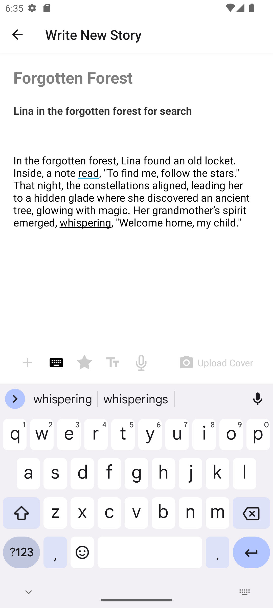
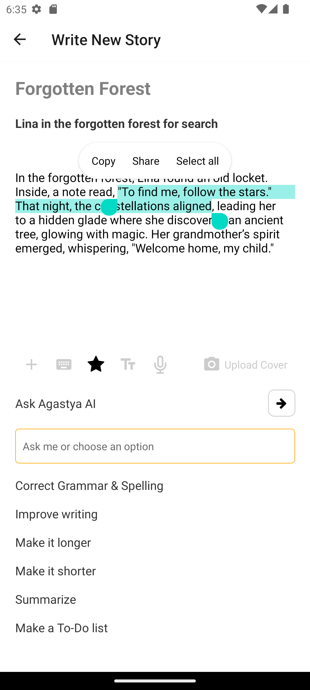
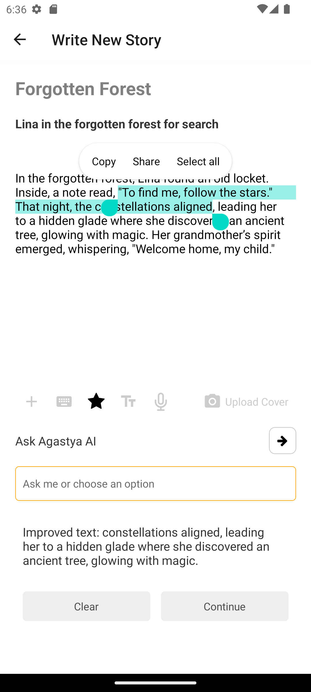

# Story Creator App

Story Creator App is React Native application designed to help users create and edit stories with ease. The app includes features for text input, formatting tools, and integration with a fictional AI assistant named Agastya to enhance the writing experience.

## Features

- Create and edit stories with title, subtitle, and body.
- Custom toolbar with keyboard, star (AI assistant), text, mic, and upload cover options.
- AI assistance with various writing suggestions (e.g., correct grammar, improve writing, summarize).
- Alert for under-development features.
- Responsive and user-friendly interface.

## Screenshots

### Welcome Screen


### Story Screen





## Installation

1. Clone the repository:

   ```bash
   git clone https://github.com/anas-ansri/StoryApp
   cd story-creator-app
   ```

2. Install dependencies:

   ```bash
   npm install
   ```

3. Start the Expo development server:
   ```bash
   npm start
   ```

## Usage

1. Open the Expo app on your emulator or physical device.
2. Scan the QR code displayed in your terminal or browser after running `npx expo start`.
3. Navigate to the "Write New Story" screen.
4. Enter the title, subtitle, and body of your story.
5. Use the custom toolbar to access different tools. Note that some features are under development and will show an alert if clicked.
6. Click on the star icon to enable the AI assistant, which will provide writing suggestions based on the story content.
7. Follow the prompts and improve your story using the AI suggestions.

## Code Structure

- `StoryScreen.js`: Main screen for writing stories. Contains text inputs for title, subtitle, and body.
- `KeyboardToolbar.js`: Custom toolbar with icons for different tools.
- `AskAgastya.js`: Component for interacting with the AI assistant and displaying suggestions.
- `StoryContext.js`: Context for managing story state (title, subtitle, body).

## Contributing

1. Fork the repository.
2. Create a new branch (`git checkout -b feature-branch`).
3. Make your changes and commit them (`git commit -m 'Add new feature'`).
4. Push to the branch (`git push origin feature-branch`).
5. Open a Pull Request.

## License

This project is licensed under the MIT License. See the [LICENSE](./LICENSE) file for details.

## Acknowledgements

- React Native
- Expo
- Icons from Expo Vector Icons
